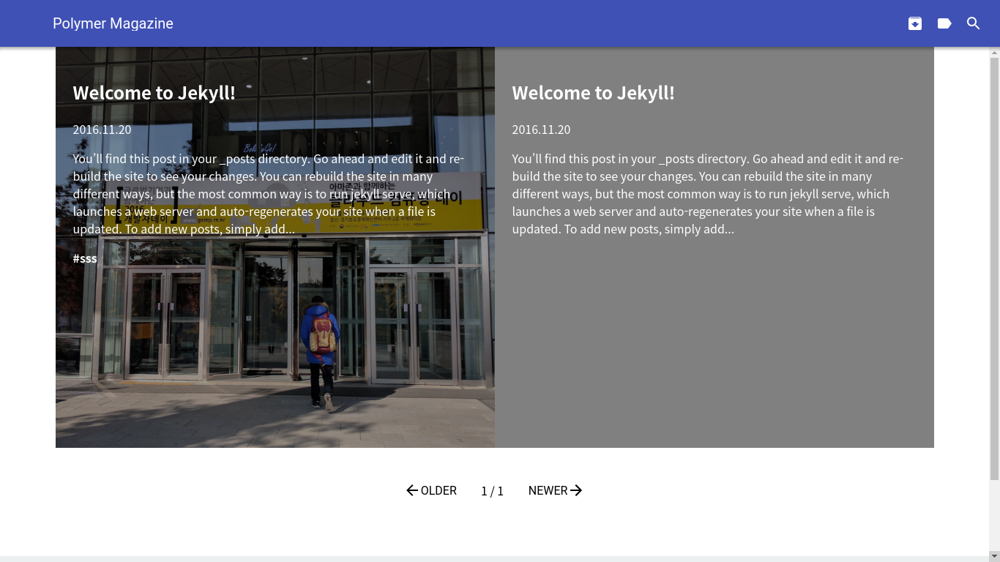
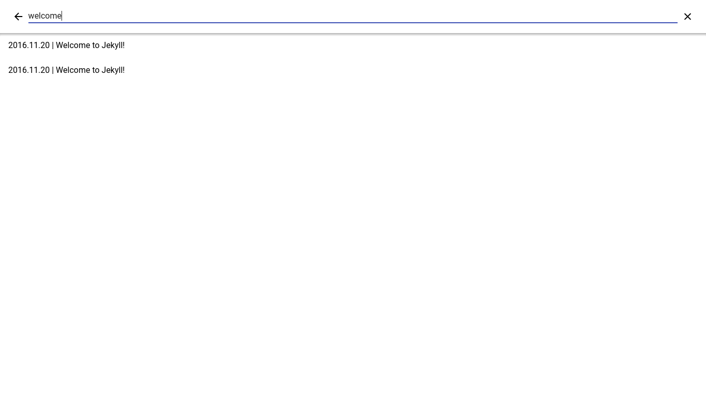
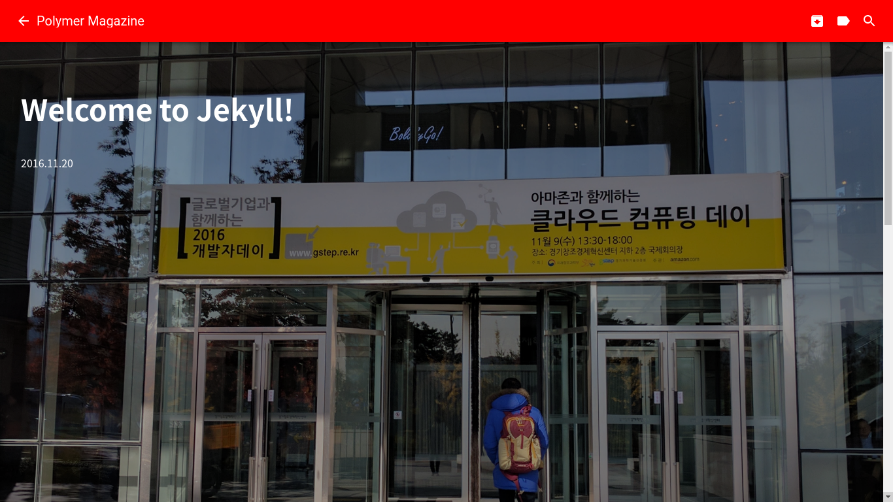
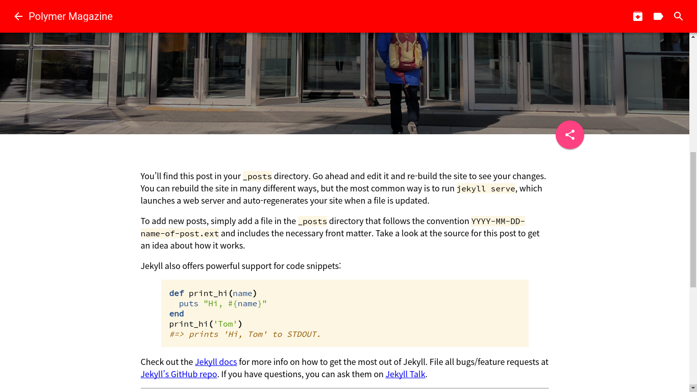
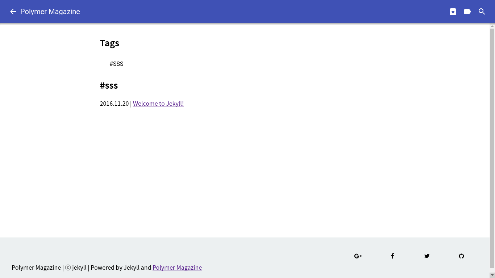
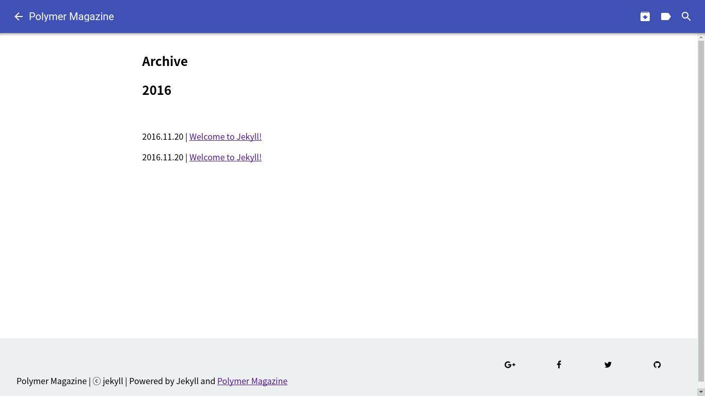

# jekyll-polymer-magazine

A [Google Design](degisn.google.com) inspired Magazine style theme for Jekyll based on Polymer Library

## Installation

### Install using gem

Add this line to your Jekyll site's Gemfile:

```ruby
gem "polymer-magazine"
```

And add this line to your Jekyll site's `_config.yml`:

```yaml
theme: polymer-magazine
```

And then execute:
```bash
$ bundle
```
Or install it yourself as:
```bash
$ gem install polymer-magazine
```

### Install without gem
Just Fork this repo. then edit `_config.yml` to suit your needs.

## License

The theme is available as open source under the terms of the [MIT License](http://opensource.org/licenses/MIT).

## Theme Preview







